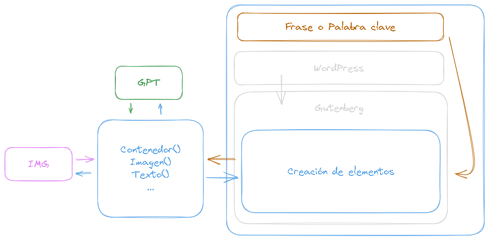

# Documentación Bot creacion paginas

Este documento proporciona una descripción y guía de uso para el código Python que actúa como un bot automatizado utilizando Selenium para interactuar con un sitio web.

## Descripción

El código Python se utiliza para automatizar la interacción con un sitio web utilizando Selenium. Realiza varias acciones, como la inserción de imágenes, títulos, párrafos, botones y contenedores en una página web de WordPress. El código se divide en funciones para realizar tareas específicas.

## Requisitos

Asegúrate de cumplir con los siguientes requisitos antes de ejecutar el código:

- Tener instalado Python en tu sistema.
- Tener instalada la biblioteca Selenium.
- Tener el controlador de Chrome (Chromedriver) instalado en tu sistema y configurado correctamente.

## Uso

1. Iniciar sesión en el sitio web de WordPress.
2. Navegar a la sección de páginas.
3. Crear una nueva página o editar una existente.
4. Ejecutar el código Python proporcionado para interactuar con la página web.

## Diagrama



## Funciones

El código Python se organiza en una serie de funciones, cada una con un propósito específico. Aquí se describen algunas de las funciones principales:

### `scroll_down(driver)`

Esta función desplaza el contenido hacia abajo en la página web.

- `driver` : Recibe el obtejo driver generado con el driver de chrome 

### `insert_image(url, col, cover)`

Inserta una imagen en la página web con la URL especificada. Puede especificar si la imagen debe ser una portada (`cover`) y la columna (`col`) en la que se debe colocar.

- `url` : URL de la imagen que se va a ingresa, es una imagen subida desde internet

- `col` : Indica si se debe ingresar el objeto en la columna actual
    - ```True```: Ingresa el texto debajo del ultimo item
    - ```False```: Ingresa el item en el primer contenedor que encuentre vacio

- `cover` : Creacion de la imagen a tipo cover
    - ```True```: Vuelve la imagen a `cover`
    - ```False```: Deja la imagen sin alterarla 

### `image_cover(driver)`

Convierte una imagen en una portada, permitiendo ajustar su diseño.

- `driver` : Recibe el obtejo driver generado con el driver de chrome 

### `insert_title(driver, title, size, col)`

Inserta un título en la página web con el texto especificado, tamaño (`size`), y columna (`col`) determinados.

- `driver` : Recibe el obtejo driver generado con el driver de chrome 

- `title` : El text que se va a generar como titulo

- `size` : Indica el tipo de titulo
    - `H1` -> `0` 
    - `H2` -> `1` 
    - `H3` -> `2` 
    - `H4` -> `3` 
    - `H5` -> `4` 

- `col` : Indica si se debe ingresar el objeto en la columna actual
    - ```True```: Ingresa el texto debajo del ultimo item
    - ```False```: Ingresa el item en el primer contenedor que encuentre vacio

### `insert_paragraph(driver, text, col)`

Inserta un párrafo en la página web con el texto especificado y en la columna (`col`) determinada.

- `driver` : Recibe el obtejo driver generado con el driver de chrome 

- `text` : Ingresa el parrafo que se va a insertar

- `col` : Indica si se debe ingresar el objeto en la columna actual
    - ```True```: Ingresa el texto debajo del ultimo item
    - ```False```: Ingresa el item en el primer contenedor que encuentre vacio

### `insert_button(driver, text, url, align, col)`

Inserta un botón en la página web con el texto, URL, alineación (`align`) y columna (`col`) especificados.

- `driver` : Recibe el obtejo driver generado con el driver de chrome 

- `text` : Ingresa el titulo que se va a insertar

- `url` : Hiperenlace para el boton
    - `Left` -> `0` 
    - `Center` -> `1` 
    - `Right` -> `2` 

- `col` : Indica si se debe ingresar el objeto en la columna actual
    - ```True```: Ingresa el texto debajo del ultimo item
    - ```False```: Ingresa el item en el primer contenedor que encuentre vacio

### `container_father(driver, index, col)`

Crea un contenedor en la página web y permite seleccionar una variante para el contenedor.

- `driver` : Recibe el obtejo driver generado con el driver de chrome 

- `index` : Indica segun las opciones un formato para el contenedor
    - `1 col` -> `0` 
    - `2 col` -> `1` 
    - `3 col` -> `2` 
    - `4 col` -> `3` 

### `add_column(driver, col)`

Añade una columna al contenedor existente en la página web.

- `driver` : Recibe el obtejo driver generado con el driver de chrome 

- `col` : Indica si se debe ingresar el objeto en la columna actual
    - ```True```: Ingresa el texto debajo del ultimo item
    - ```False```: Ingresa el item en el primer contenedor que encuentre vacio

### `wait_and_click(driver, by, value)`

Espera a que un elemento sea clickeable y luego lo hace.

- `driver` : Recibe el obtejo driver generado con el driver de chrome 

- `by` : Ingresa el tipo por el cual va a buscar `selenium`, por ejemplo
    ```python
        By.CLASS_NAME
    ```

- `value` : El elemento que debe buscar

### `wait_and_send_keys(driver, by, value, keys)`

Espera a que un elemento esté presente y luego envía teclas.

- `driver` : Recibe el obtejo driver generado con el driver de chrome 

- `by` : Ingresa el tipo por el cual va a buscar `selenium`, por ejemplo
    ```python
        By.CLASS_NAME
    ```

- `value` : El elemento que debe buscar

- `keys` : Ingresa la tecla que va a ingresar `selenium`, por ejemplo
    ```python
        Keys.ENTER
    ```

### `wait_and_insert_item(driver, value, iconClass, col)`

Inserta un elemento en la página web y espera a que esté presente antes de hacerlo.

- `driver` : Recibe el obtejo driver generado con el driver de chrome 

- `value` : El elemento que debe buscar

- `iconClass` : la clase del boton del icono que va a dar click

- `col` : Indica si se debe ingresar el objeto en la columna actual
    - ```True```: Ingresa el texto debajo del ultimo item
    - ```False```: Ingresa el item en el primer contenedor que encuentre vacio

## Ejecución

Para ejecutar el código, sigue los pasos a continuación:

1. Asegúrate de tener Python y las bibliotecas necesarias instaladas.
2. Configura el controlador de Chrome (Chromedriver) en la ubicación correcta.
3. Modifica el código según tus necesidades, especialmente las URL y el contenido.
4. Ejecuta el script Python.

## Notas

- Este código se ha diseñado específicamente para interactuar con un sitio web de WordPress. Asegúrate de que la estructura del sitio web y los selectores de elementos sean compatibles con tu sitio.
